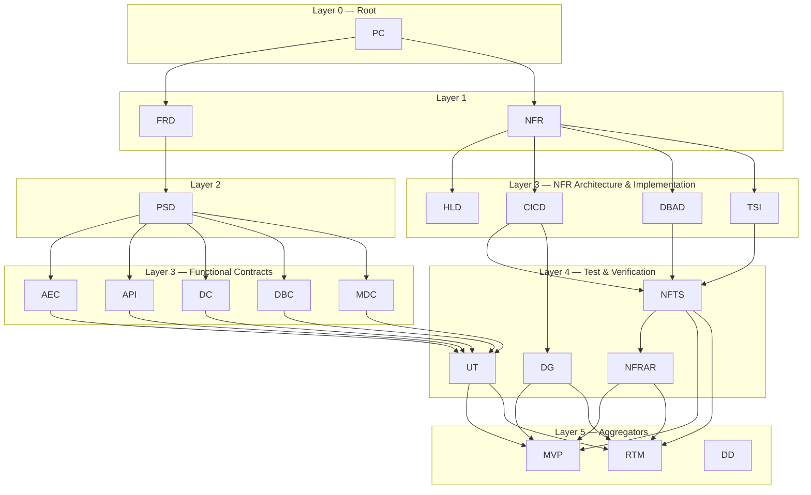

# SDLC Document Tree Builder — Create the Full Document Tree

## Purpose

Build out every document in the SDLC tree in the correct dependency
order, starting from the PC as the root.  The skill tracks progress
across all 20 document slots and ensures no downstream doc is created
before its parents exist.  Both the functional branch (FRD → PSD →
contracts → UT) and the NFR branch (NFR → architecture → implementation
→ test) are covered, converging at the aggregator layer (MVP, RTM, DD).

## Environment

- **Base directory:** `.`
- **CLI module:** `knowledge/sdlc_chain/cli.py`
- **Invoke CLI as:** `python3 knowledge/sdlc_chain/cli.py <command> [args]`
  (run from the base directory)
- **Artifact files:** `knowledge/artifact/[subdir]/[TYPE]-NNNN_*.json`
- **Rendered Markdown:** `knowledge/req_doc/md/[subdir]/[TYPE]-NNNN_*.md`
- **Rendered HTML:** `knowledge/req_doc/html/[subdir]/[TYPE]-NNNN_*.html`
- **Archive dir:** `archive/[subdir]/` — older versions moved here before overwrite
- **Staging dir:** `knowledge/staging/[subdir]/` — signed-off documents awaiting final approval
- **Archive before overwrite:** `python3 knowledge/sdlc_chain/cli.py archive [PATH]`
- **Stage after sign-off:** `python3 knowledge/sdlc_chain/cli.py stage [PATH]`

### CLI Commands

| Command | Description |
|---------|-------------|
| `list-existing` | Scan `knowledge/artifact/`, `knowledge/req_doc/md/`, `knowledge/req_doc/html/`, and `knowledge/staging/` for existing documents |
| `template <DOC_TYPE>` | Extract template sections + README guidance as JSON |
| `archive <PATH>` | Copy file to `archive/[subdir]/` before overwriting |
| `validate <DOC_TYPE> <PATH>` | Validate JSON against template required sections |
| `downstream <DOC_TYPE>` | BFS traversal — returns all transitive downstream doc types with hop counts and layer numbers |
| `detect <PATH>` | Auto-detect the document type of a YAML or JSON file; returns JSON |
| `mapping-template <PC_PATH> <PROJECT_CODE>` | Generate a module mapping template YAML from a PC file |
| `stage <PATH>` | Copy a signed-off document to `knowledge/staging/[subdir]/` for approval handoff |

---

## SDLC Document Tree



### Doc-type quick reference

| Layer | Code  | Full Name                        | Template dir           | Branch     |
|-------|-------|----------------------------------|------------------------|------------|
| 0     | PC    | Platform Canon                   | `00_general`           | Root       |
| 1     | FRD   | Functional Requirements          | `10_function`          | Functional |
| 1     | NFR   | Non-Functional Requirements      | `20_non_function`      | NFR        |
| 2     | PSD   | Product Specification            | `30_logical`           | Functional |
| 3     | AEC   | Async Event Contract             | `40_contract`          | Functional |
| 3     | API   | API Specification (OpenAPI)      | `40_contract`          | Functional |
| 3     | DC    | Data Contract                    | `40_contract`          | Functional |
| 3     | DBC   | Database Contract                | `40_contract`          | Functional |
| 3     | MDC   | Market Data Contract             | `50_external_contract` | Functional |
| 3     | HLD   | High-Level Design                | `60_architecture`      | NFR        |
| 3     | TSI   | Technical System Integration     | `60_architecture`      | NFR        |
| 3     | CICD  | CI/CD Framework                  | `70_nf_implementation` | NFR        |
| 3     | DBAD  | Database Architecture Design     | `70_nf_implementation` | NFR        |
| 4     | NFTS  | Non-Functional Test Spec         | `70_nf_implementation` | NFR        |
| 4     | DG    | Deployment Guide                 | `70_nf_implementation` | NFR        |
| 4     | UT    | Unit Test Document               | `80_test`              | Functional |
| 4     | NFRAR | NFR Analysis Report              | `80_test`              | NFR        |
| 5     | MVP   | Minimum Viable Product Plan      | `90_project`           | Both       |
| 5     | RTM   | Requirements Traceability Matrix | `90_project`           | Both       |
| 5     | DD    | Data Dictionary                  | `90_project`           | Both       |

---

## PHASE 1 — Tree Dashboard

### Step 1a — Scan existing documents

```bash
python3 knowledge/sdlc_chain/cli.py list-existing
```

This scans `knowledge/artifact/`, `knowledge/req_doc/md/`, `knowledge/req_doc/html/`, and `knowledge/staging/` directories.
Cache this output for the entire session.

### Step 1b — Build the dashboard

From the cached output, check each of the 20 tree slots and present:

```
## SDLC Document Tree Dashboard

                          FUNCTIONAL BRANCH
SLOT       DOCUMENT ID       VERSION   STATUS      PATH
──────────────────────────────────────────────────────────────────────────
PC         PC-NPH-0001       v0.3      Draft       knowledge/artifact/00_general/...
FRD        FRD-NPH-0001      v0.2      Draft       knowledge/artifact/10_function/...
PSD        —                 —         NOT FOUND   —
AEC        —                 —         NOT FOUND   —
API        —                 —         NOT FOUND   —
DC         —                 —         NOT FOUND   —
DBC        —                 —         NOT FOUND   —
MDC        —                 —         NOT FOUND   —
UT         —                 —         NOT FOUND   —

                          NFR BRANCH
SLOT       DOCUMENT ID       VERSION   STATUS      PATH
──────────────────────────────────────────────────────────────────────────
NFR        NFR-0001          v0.2      Draft       knowledge/artifact/20_non_function/...
HLD        —                 —         NOT FOUND   —
CICD       —                 —         NOT FOUND   —
DBAD       DBAD-0001         v0.1      Draft       knowledge/artifact/70_nf_implementation/...
TSI        —                 —         NOT FOUND   —
NFTS       —                 —         NOT FOUND   —
DG         —                 —         NOT FOUND   —
NFRAR      —                 —         NOT FOUND   —

                          CONVERGENCE
SLOT       DOCUMENT ID       VERSION   STATUS      PATH
──────────────────────────────────────────────────────────────────────────
MVP        —                 —         NOT FOUND   —
RTM        —                 —         NOT FOUND   —
DD         —                 —         NOT FOUND   —

Progress: 4 / 20 docs exist   ████░░░░░░░░░░░░ 20%

Recommended next action:
  → PC exists — its functional requirements will seed FRD, its NFR items will seed NFR.
  → FRD exists — proceed to PSD, then contracts (AEC, API, DC, DBC, MDC).
  → NFR exists — proceed to hop-1 docs (HLD, CICD, TSI).
  → Missing functional Layer 2: PSD
  → Missing NFR Layer 3: HLD, CICD, TSI
```

### Step 1c — Choose workflow

Ask:

```
How would you like to proceed?

  1. Walk through the entire tree (both branches, layer by layer)
  2. Walk the functional branch only (PC → FRD → PSD → contracts → UT)
  3. Walk the NFR branch only (PC → NFR → architecture → implementation → test)
  4. Start from a specific document (I'll check prerequisites are met)
  5. Update an existing document in the tree

Reply 1, 2, 3, 4, or 5:
```

**If 1:** Process both branches interleaved by layer (Phase 2). Begin at the
PC slot. If PC already exists, ask:
"PC-XXXX already exists (vX.Y). Would you like to (a) review & update it,
(b) skip to the next missing doc, or (c) start fresh with a new PC?"
Apply the same logic for every subsequent slot.

**If 2:** Process only: PC → FRD → PSD → AEC → API → DC → DBC → MDC → UT.
Skip all NFR-branch docs. At the end, note that convergence docs (MVP, RTM, DD)
require both branches — flag if NFR branch is incomplete.

**If 3:** Process only: PC → NFR → HLD → CICD → DBAD → TSI → NFTS → DG → NFRAR.
Skip all functional-branch docs. At the end, note convergence doc status.

**If 4:** Ask which doc type. Validate prerequisites:
- FRD requires PC to exist.
- NFR requires PC to exist.
- PSD requires FRD to exist.
- Contracts (AEC, API, DC, DBC, MDC) require PSD to exist.
- HLD, CICD, DBAD, TSI require NFR to exist.
- NFTS requires CICD + DBAD + TSI.  DG requires CICD.
- UT requires at least one contract (AEC, API, DC, DBC, or MDC) to exist.
- NFRAR requires NFTS to exist.
- MVP, RTM require NFTS and/or DG and/or UT to exist.
- DD can be created at any time (aggregates all existing artifacts).

If prerequisites are missing, report:

```
⚠️  Cannot create [TYPE] yet — missing prerequisite(s): [list]
     Create those first, or choose option 1 to walk the tree in order.
```

**If 5:** Show only the existing docs from the dashboard. Let the user
pick one. Proceed to Phase 2 in update mode for that doc.

---

## PHASE 2 — Document Creation / Update Loop

Process documents in this fixed order (layer-by-layer, interleaved):
1. **PC**  (Layer 0 — root, seeds both branches)
2. **FRD** → **NFR**  (Layer 1, alphabetical)
3. **PSD**  (Layer 2)
4. **AEC** → **API** → **DC** → **DBC** → **HLD** → **MDC** → **CICD** → **DBAD** → **TSI**  (Layer 3, alphabetical)
5. **DG** → **NFTS** → **UT**  (Layer 4, alphabetical)
6. **NFRAR**  (Layer 4, after NFTS)
7. **DD** → **MVP** → **RTM**  (Layer 5, alphabetical)

For each slot, if the user chose "walk through entire tree":
- If the doc already exists, ask: "review & update / skip / replace"
- If the doc does not exist, proceed to create it.

### Step 2a — Load template and README guidance

```bash
python3 knowledge/sdlc_chain/cli.py template [DOC_TYPE]
```

Read the JSON output silently. Use `sections` as the Q&A roadmap and
`readme_guidance` for context. Do NOT show raw JSON to the user.

### Step 2b — Announce the doc

```
━━━━━━━━━━━━━━━━━━━━━━━━━━━━━━━━━━━━━━━━━━━━━━━━━━━━━━
  [N] / 20 — [DOC_TYPE]: [Full Name]
  Layer [L] — [parent doc(s)] → [this doc] → [child doc(s)]
━━━━━━━━━━━━━━━━━━━━━━━━━━━━━━━━━━━━━━━━━━━━━━━━━━━━━━

[1-2 sentence purpose summary from template README]

Parent docs available:
  ✅ PC-NPH-0001 v0.3
  ✅ FRD-NPH-0001 v0.2

This document feeds into: [child types]
```

### Step 2c — Section-by-section Q&A

Use the groupings below. For each group:

1. Announce the section: `## Section: [Name] ([N] of [total])`
2. Quote guidance: `> **Guidance:** [text from template README]`
3. If parent docs exist, surface relevant parent content to help the
   user fill in derived fields. For example, when creating PSD, show
   the FRD's `functional_requirements` for the specific function.
4. Ask open, section-level questions in prose (NOT field-by-field).
5. Confirm interpretation, then move to the next group.

Build the document in memory as you go. Do NOT write files during Q&A.

#### PC groupings

| Group | Sections |
|-------|----------|
| G1 | `metadata` — title, project code, author, reviewer, approver, classification, related doc IDs, tags, supersedes |
| G2 | `executive_summary` + `problem_statement` |
| G3 | `objectives` — each with its success measure |
| G4 | `scope` — in-scope, out-of-scope, domain definitions |
| G5 | `stakeholders` + `current_state` + `future_state` |
| G6 | `requirements` — functional, NFR, and constraints separately |
| G7 | `assumptions_and_constraints` + `risks` + `dependencies` |
| G8 | `success_metrics` + `glossary` (optional) |

**K8s-style envelope format (CRITICAL — applies to ALL doc types except API):**
All artifacts must be written in **K8s-style envelope format** with
`kind` at the top level, followed by `metadata` and the document's
content sections. The flat template is for reading guidance only.

Envelope structure:
```json
{
  "kind": "<KindName>",
  "metadata": { ... },
  "<section_1>": { ... },
  "<section_2>": { ... }
}
```

Kind values by doc type:

| Doc Type | `kind` Value                     |
|----------|----------------------------------|
| PC       | `PlatformCanon`                  |
| FRD      | `FunctionalRequirements`         |
| NFR      | `NonFunctionalRequirements`      |
| PSD      | `ProductSpecification`           |
| AEC      | `AsyncEventContract`             |
| API      | *(uses raw OpenAPI 3.1 format — no K8s envelope)* |
| DC       | `DataContract`                   |
| DBC      | `DesignByContract`               |
| MDC      | `MarketDataContract`             |
| HLD      | `HighLevelDesign`                |
| CICD     | `CICDFramework`                  |
| DBAD     | `DatabaseArchitectureDesign`     |
| TSI      | `TechnicalSystemIntegration`     |
| NFTS     | `NonFunctionalTestSpec`          |
| DG       | `DeploymentGuide`                |
| UT       | `UnitTestSpecification`          |
| NFRAR    | `NFRAnalysisReport`              |
| MVP      | `MinimumViableProductPlan`       |
| RTM      | `RequirementsTraceabilityMatrix` |
| DD       | `DataDictionary`                 |

**ID patterns:**
- **PC:** `PC-[PROJECT]-[NNNN]` (e.g. `PC-NPH-0001`) — ask user for project code
- **FRD:** `FRD-[PROJECT]-[NNNN]` (e.g. `FRD-NPH-0001`)
- **All others:** `[TYPE]-[NNNN]` (e.g. `CICD-0001`, `PSD-0001`)

**PC → FRD linkage:**
The PC `requirements` section contains functional requirements. When
the user completes the PC, extract all functional items from
`requirements` and surface them when starting the FRD to pre-seed the
module scope. This ensures traceability from business requirements
through to contracts and tests.

**PC → NFR linkage:**
The PC `requirements` section also contains non-functional requirements.
Extract all NFR-related items (constraints, performance expectations,
security/compliance needs) and surface them when starting the NFR to
pre-seed the NFR catalog.

---

#### FRD groupings

| Group | Sections |
|-------|----------|
| G1 | `metadata` — document_id, module_code, title, version, status, classification, dates, author, reviewer, approver, parent_brd, related_documents, tags, supersedes |
| G2 | `overview` + `scope` + `definitions` |
| G3 | `business_context` + `actors` |
| G4 | `functional_overview` + `event_triggers` |
| G5 | `functional_requirements` (by functional area, each with acceptance criteria) |
| G6 | `business_rules` + `exception_scenarios` |
| G7 | `module_interface` (APIs provided, events published, data owned) + `cross_module_interactions` |
| G8 | `data_requirements` + `nonfunctional_requirements` |
| G9 | `traceability` + `acceptance_criteria` |
| G10 | `assumptions_and_constraints` + `dependencies` + `open_issues` + `approvals` + `change_log` |

**Parent content to surface:**
- PC `requirements.functional` → seed functional_requirements by module
- PC `scope` → constrain FRD scope boundaries
- PC `stakeholders` → seed actors list

**FRD generator special case:**
If a PC exists, offer to use the FRD generator to pre-populate the draft:
1. Show the PC's functional requirement IDs.
2. Generate a mapping template: `python3 knowledge/sdlc_chain/cli.py mapping-template [PC_PATH] [PROJECT_CODE]`
3. Ask the user to split requirements into logical modules.
4. Invoke `generate_frd(pc, module, project_code, sequence)` from `frd_generator.py`.
5. In Q&A, focus on sections marked `[AUTO - Review]` and `[DRAFT - Needs Review]`.

---

#### NFR groupings

| Group | Sections |
|-------|----------|
| G1 | `metadata` |
| G2 | `document_control` + `traceability_model` |
| G3 | `nfr_catalog` (by ISO 25010 category: Performance, Reliability, Usability, Maintainability, Security, Observability, Portability, Compatibility) |
| G4 | `nfr_baseline_checklist` |
| G5 | `compliance_mapping` (optional) |
| G6 | `open_items` + `stakeholder_signoff` |
| G7 | `appendix_rtm_mapping` + `change_log` |

---

#### PSD groupings

| Group | Sections |
|-------|----------|
| G1 | `metadata` |
| G2 | `function_overview` (summary, function_type, module, triggering_actor) |
| G3 | `user_roles_and_permissions` + `preconditions_and_dependencies` |
| G4 | Type-specific spec — ask which type applies: |
|     | • `data_page_spec` — entity, field_catalog with CRUD, list/detail views, operations |
|     | • `process_flow_spec` — trigger, inputs, steps, outputs, error handling, SLA |
|     | • `status_group_spec` — statuses, transitions, matrix |
| G5 | `business_rules` |
| G6 | `ui_specification` (if applicable) |
| G7 | `acceptance_criteria` + `traceability` |
| G8 | `change_log` |

**Parent content to surface:**
- FRD `functional_requirements` for the specific function → seed acceptance criteria
- FRD `data_requirements.entities` → seed field_catalog in data_page_spec
- FRD `event_triggers` → seed process_flow_spec triggers
- FRD `actors` → seed user_roles_and_permissions

**PSD function_type selection:**
Before starting G4, ask: "What type of function is this?"
- **DATA_PAGE** — CRUD operations on an entity (field catalog, list/detail views)
- **PROCESS_FLOW** — Multi-step process with decision branches
- **STATUS_GROUP** — State machine with transition rules
Only the matching spec section is required; the others are omitted.

---

#### AEC groupings

| Group | Sections |
|-------|----------|
| G1 | `metadata` |
| G2 | `event_overview` (event_name, domain, event_type, business description, trigger condition) |
| G3 | `ownership` (producer_team, registered_consumers, escalation contact) |
| G4 | `channel_config` (Kafka: topic, partition strategy, replication, retention, compression) |
| G5 | `message_spec` (envelope, headers, payload, content-type, schema registry) |
| G6 | `data_transformation` (producer mapping, consumer mappings, field mappings) |
| G7 | `schema_evolution` (compatibility strategy, breaking changes, deprecation policy) |
| G8 | `delivery_sla` (guarantee, ordering, throughput, latency, availability, retry, DLT, idempotency) |
| G9 | `security` (auth, authorization, encryption, ACLs, PII handling, compliance) |
| G10 | `observability` (metrics, dashboards, alerting, tracing, logging) + `change_log` |

**Parent content to surface:**
- PSD `process_flow_spec.outputs` or `data_page_spec.operations` → event triggers
- FRD `event_triggers` → event name, domain, trigger conditions
- FRD `module_interface.events_published` → event catalog

---

#### API groupings

| Group | Sections |
|-------|----------|
| G1 | `info` + `servers` (title, description, version, base URLs) |
| G2 | `paths` — endpoint by endpoint (method, parameters, request/response schemas) |
| G3 | `components.schemas` + `components.parameters` (resource definitions, reusable params) |
| G4 | `security` + `components.securitySchemes` (auth schemes, scopes) |
| G5 | `tags` + traceability extensions (`x-source-frd`, `x-generated-date`) |

**Parent content to surface:**
- FRD `module_interface.apis_provided` → endpoint paths and operations
- PSD `data_page_spec.field_catalog` → response schema fields
- PSD `acceptance_criteria` → API response expectations

**API special case:**
API documents use **raw OpenAPI 3.1 YAML format**, NOT K8s envelope.
The artifact file is still `.json` but follows the OpenAPI structure
(`openapi`, `info`, `paths`, `components`, etc.) instead of
`kind`/`metadata`/sections.

---

#### DC groupings

| Group | Sections |
|-------|----------|
| G1 | `metadata` |
| G2 | `contract_overview` + `data_product_identification` (product_name, domain, owner_team, steward, tier) |
| G3 | `schema_definition` (format, fields with type/constraints/PII flags, nullability, primary/foreign keys) |
| G4 | `semantic_definitions` (business glossary, business rules) |
| G5 | `data_quality_standards` + `service_level_agreements` |
| G6 | `access_and_security` + `lineage_and_dependencies` |
| G7 | `versioning_and_compatibility` + `sample_fixture` |
| G8 | `change_log` |

**Parent content to surface:**
- FRD `data_requirements.entities` → schema fields and types
- PSD `data_page_spec.field_catalog` → field definitions with CRUD flags
- PSD `business_rules` → data quality rules

---

#### DBC groupings

| Group | Sections |
|-------|----------|
| G1 | `metadata` |
| G2 | `introduction` + `service_boundary` (service_name, bounded_context, protocol, dependencies) |
| G3 | `glossary` (DbC terminology definitions) |
| G4 | `contract_catalogue` — per operation: preconditions, postconditions, error postconditions, invariants |
| G5 | `error_handling_strategy` |
| G6 | `testing_and_monitoring` (contract verification approach) |
| G7 | `change_log` |

**Parent content to surface:**
- API endpoint definitions → operation signatures for contract catalogue
- AEC event specs → async contract preconditions/postconditions
- PSD `acceptance_criteria` → postcondition assertions

---

#### MDC groupings

| Group | Sections |
|-------|----------|
| G1 | `metadata` |
| G2 | `contract_overview` + `data_product_identification` |
| G3 | `input_and_source_location` (source systems, delivery mechanisms, formats, schedule, authentication, public URLs) |
| G4 | `source_data_catalog` (L1) + `dataset_extraction_plan` (L2, incl. per-dataset write path behaviour) |
| G5 | `canonical_key_resolution` (L3: composite key derivation, 6 canonical key columns, per-dataset key resolution, entity resolution mechanics) |
| G6 | `field_extraction_spec` (L4: per-dataset, per-field mapping tables) |
| G7 | `end_result` (L5: DC-0004 snapshot mockups per dataset) + `semantic_definitions` (glossary + business rules) |
| G8 | `data_quality_standards` + `service_level_agreements` |
| G9 | `access_and_security` + `lineage_and_dependencies` (incl. `canonical_entity_integration`, `search_mode` per consumer) |
| G10 | `versioning_and_compatibility` + `sample_fixture` + `support_and_communication` + `change_log` |

**Parent content to surface:**
- DC schema → canonical field mapping baseline
- PSD `data_page_spec` (if applicable) → entity definitions for canonical key resolution
- FRD `data_requirements` → data sources and entities

**MDC market-search integration:**
Only use market-search when the user provides just the desired market
(exchange name or code) without full source details:
```bash
python3 knowledge/market_search/search.py sources [EXCHANGE_CODE]
```
If the user already has specific source URLs, delivery mechanisms, and
formats, skip market-search and proceed directly.

---

#### HLD groupings

| Group | Sections |
|-------|----------|
| G1 | `metadata` |
| G2 | `introduction` + `design_goals_and_constraints` |
| G3 | `system_architecture_overview` + `component_design` |
| G4 | `technology_stack` + `data_architecture` |
| G5 | `integration_architecture` + `security_architecture` |
| G6 | `deployment_architecture` + `observability_and_operations` |
| G7 | `design_decisions` + `risks_and_mitigations` + `future_considerations` + `glossary` + `change_log` |

**NFR linkage hints for HLD:**
- `performance_requirements` → design goals, architecture style decisions
- `security_requirements` → security architecture (authN, authZ, data protection)
- `availability_reliability` → deployment architecture, observability SLAs
- `scalability_requirements` → architecture style, component design patterns
- `monitoring_observability` → observability & operations section
- `integration_requirements` → integration architecture

#### CICD groupings

| Group | Sections |
|-------|----------|
| G1 | `metadata` |
| G2 | `introduction` + `principles_and_strategy` |
| G3 | `source_control_strategy` + `continuous_integration` |
| G4 | `continuous_delivery` + `quality_gates` |
| G5 | `security` (DevSecOps) |
| G6 | `monitoring_and_feedback` + `pipeline_templates` |
| G7 | `roles_and_responsibilities` + `exception_process` + `change_log` |

**NFR linkage hints for CICD:**
- `performance_requirements` → pipeline SLA targets, build time limits
- `security_requirements` → security scanning stages, supply-chain controls
- `availability_reliability` → deployment strategy (blue-green, canary), rollback SLA
- `deployment_requirements` → environment promotion strategy
- `compliance_regulatory` → audit trail, approval gates

#### DBAD groupings

| Group | Sections |
|-------|----------|
| G1 | `metadata` |
| G2 | `introduction` + `architecture_overview` |
| G3 | `logical_data_model` + `physical_data_model` |
| G4 | `indexing_strategy` + `data_access_patterns` |
| G5 | `partitioning_and_sharding` (optional) + `security_and_access_control` |
| G6 | `backup_and_recovery` + `performance_and_optimization` |
| G7 | `migration_and_versioning` + `monitoring_and_alerting` |
| G8 | `high_availability` + `data_lifecycle_management` + `change_log` |

**NFR linkage hints for DBAD:**
- `scalability_requirements` → partitioning/sharding decisions, capacity planning
- `data_requirements` → data model, retention, encryption at rest
- `security_requirements` → access control, audit logging, data masking
- `availability_reliability` → replication topology, RPO/RTO targets

#### TSI groupings

| Group | Sections |
|-------|----------|
| G1 | `metadata` |
| G2 | `executive_summary` + `system_context` |
| G3 | `technology_stack_summary` (8 layer categories) |
| G4 | `technology_registry` (per-technology detail) |
| G5 | `version_compatibility_matrix` + `licensing_summary` |
| G6 | `eol_deprecation_tracker` + `security_considerations` |
| G7 | `architecture_decision_references` + `dependency_map` + `operational_notes` + `change_log` |

**NFR linkage hints for TSI:**
- `integration_requirements` → upstream/downstream systems, integration patterns
- `monitoring_observability` → monitoring tools in tech stack, observability layer
- `security_requirements` → security layer in tech stack, vulnerability scanning

#### NFTS groupings

| Group | Sections |
|-------|----------|
| G1 | `metadata` — reference all parent docs in `related_documents` list (NFR, CICD, DBAD, TSI), tags, supersedes |
| G2 | `introduction` + `references` + `test_strategy` |
| G3 | `entry_exit_criteria` + `test_environment` + `test_data` |
| G4 | `performance_testing` (derive from NFR performance + CICD pipeline metrics) |
| G5 | `security_testing` (derive from NFR security + CICD DevSecOps) |
| G6 | `reliability_availability_testing` (derive from NFR availability + DBAD HA) |
| G7 | `scalability_testing` + `usability_testing` + `compatibility_testing` (optional) |
| G8 | `defect_management` + `roles_and_responsibilities` + `risks_and_mitigations` + `reporting` + `change_log` |

**Parent content to surface:**
- NFR `nfr_catalog` items by category → acceptance criteria per test type
- CICD quality gates → entry/exit criteria alignment
- DBAD performance baselines → performance test targets
- TSI tech stack → test environment + compatibility matrix

#### DG groupings

| Group | Sections |
|-------|----------|
| G1 | `metadata` |
| G2 | `introduction` + `deployment_architecture` |
| G3 | `environment_configuration` |
| G4 | `pre_deployment_checklist` + `deployment_procedure` |
| G5 | `post_deployment_verification` + `rollback_procedure` |
| G6 | `troubleshooting_guide` + `communication_plan` |
| G7 | `maintenance_windows` + `disaster_recovery` (optional) + `change_log` |

**Parent content to surface:**
- CICD deployment pipeline → deployment procedure steps
- CICD rollback/recovery → rollback procedure
- NFR `availability_reliability` → RTO/RPO for disaster recovery
- NFR `deployment_requirements` → environment strategy
- NFR `monitoring_observability` → post-deployment verification checks

#### UT groupings

| Group | Sections |
|-------|----------|
| G1 | `metadata` |
| G2 | `unit_under_test` (function/module name, location in codebase) + `test_objectives` |
| G3 | `test_cases` (per case: ID, name, preconditions, inputs, expected outputs, assertions) |
| G4 | `mocking_strategy` + `coverage_targets` + `change_log` |

**Parent content to surface:**
- AEC event specs → event handler test cases
- API endpoint definitions → request/response validation tests
- DC field constraints → data validation test cases
- DBC preconditions/postconditions → assertion-based test cases
- PSD `acceptance_criteria` → acceptance test derivation

---

#### NFRAR groupings

| Group | Sections |
|-------|----------|
| G1 | `metadata` |
| G2 | `executive_summary` + `scope_and_objectives` |
| G3 | `acceptance_criteria_reference` (pull from NFR catalog + NFTS criteria) |
| G4 | `test_environment` + `test_execution_summary` |
| G5 | `detailed_test_results` (per NFR item: threshold vs actual, verdict) |
| G6 | `risk_assessment` + `recommendations` |
| G7 | `sign_off` + `change_log` |

**Parent content to surface:**
- NFTS test scenarios → test execution summary + detailed results
- NFR `nfr_catalog` items → acceptance criteria reference

#### MVP groupings

| Group | Sections |
|-------|----------|
| G1 | `metadata` |
| G2 | `mvp_objective` + `success_criteria` |
| G3 | `scope` (in/out/assumptions) |
| G4 | `tasks` (workstreams — derive from NFR categories + NFTS/DG/UT deliverables) |
| G5 | `dependencies_and_risks` |
| G6 | `timeline` + `definition_of_done` + `communication` + `change_log` |

**Parent content to surface:**
- NFTS test types → task workstreams for test execution
- DG deployment procedure → task workstream for deployment readiness
- UT test cases → task workstream for functional test execution
- NFRAR (if exists) → tasks for addressing any conditional acceptances

#### RTM groupings

| Group | Sections |
|-------|----------|
| G1 | `metadata` |
| G2 | `purpose_and_scope` + `artifact_registry` |
| G3 | `traceability_matrix` — one row per requirement (both functional and NFR): trace through design → contracts → tests → results |
| G4 | `coverage_summary` + `gap_analysis` |
| G5 | `bidirectional_verification` + `sign_off` + `change_log` |

**Parent content to surface:**
- FRD `functional_requirements` → functional requirement rows
- NFR `nfr_catalog` → NFR requirement rows
- NFR `appendix_rtm_mapping` → column definitions
- PSD/AEC/API/DC/DBC → design/contract link per functional requirement
- CICD/DBAD/TSI → design link per NFR requirement
- UT → functional test case IDs per requirement
- NFTS → NFR test case IDs per requirement
- NFRAR → test status + verdict per NFR requirement

#### DD groupings

| Group | Sections |
|-------|----------|
| G1 | `metadata` |
| G2 | `introduction` (summary of all SDLC artifacts mined) |
| G3 | `data_domains` (per domain from FRD/PSD) |
| G4 | `data_elements_catalog` (per field from DC/FRD) |
| G5 | `entity_relationship_summary` (ER diagram reference from DC/FRD) |
| G6 | `code_tables` (enumeration values) |
| G7 | `data_glossary` (term definitions aggregated from all docs) |
| G8 | `data_lineage` (source → transform → destination from DC/MDC) |
| G9 | `data_quality_rules` + `change_log` |

**Parent content to surface:**
- FRD `data_requirements` → domains and entities
- DC `schema_definition` → field catalog
- MDC `field_extraction_spec` → source-to-canonical mappings
- PSD `data_page_spec.field_catalog` → CRUD-level field definitions
- All doc glossaries → aggregated data glossary

---

## PHASE 3 — Document Generation

After all sections for the current doc are confirmed:

### Step 3a — Generate document ID

Use sequence number = 1 + count of existing docs of this type from
`list-existing`.

- **PC:** `PC-[PROJECT]-[NNNN]` (e.g. `PC-NPH-0001`) — ask user for project code
- **FRD:** `FRD-[PROJECT]-[NNNN]` (e.g. `FRD-NPH-0001`)
- **All others:** `[TYPE]-[NNNN]` (e.g. `CICD-0001`)

### Step 3b — Confirm output paths

```
I'll write these files:

  JSON:  knowledge/artifact/[subdir]/[TYPE]-[NNNN]_[ShortTitle]_v[X.Y].json
  MD:    knowledge/req_doc/md/[subdir]/[TYPE]-[NNNN]_[ShortTitle]_v[X.Y].md
  HTML:  knowledge/req_doc/html/[subdir]/[TYPE]-[NNNN]_[ShortTitle]_v[X.Y].html

Proceed? (yes / no)
```

### Step 3c — Write files

**1. Write temp JSON via the Write tool:**

Write the complete document dict to `knowledge/.tmp/sdlc_tree_[TYPE].json`.

**2. Archive (update mode only):**

```bash
python3 knowledge/sdlc_chain/cli.py archive [EXISTING_PATH]
```

Confirm success before overwriting.

**3. Write JSON artifact:**

```bash
python3 -c "
import sys, json
sys.path.insert(0, '.')
from sdlc_chain.yaml_utils import dump_json
from pathlib import Path

with open('knowledge/.tmp/sdlc_tree_[TYPE].json', encoding='utf-8') as f:
    doc = json.load(f)

out = '[ARTIFACT_PATH]'
Path(out).parent.mkdir(parents=True, exist_ok=True)
dump_json(doc, out)
print(json.dumps({'path': out, 'status': 'ok'}))
"
```

**4. Validate:**

```bash
python3 knowledge/sdlc_chain/cli.py validate [TYPE] [ARTIFACT_PATH]
```

Report errors. Stop on required-section failures.

**5. Write Markdown** using the Write tool. Render using the standard
section-based format (see intake skill rendering rules).

**For FRD:** Use the dedicated Markdown renderer:
```bash
python3 -c "
import sys, json
sys.path.insert(0, '.')
from sdlc_chain.generators.md_renderer import render_frd_markdown

with open('knowledge/.tmp/sdlc_tree_FRD.json', encoding='utf-8') as f:
    frd_dict = json.load(f)

md = render_frd_markdown(frd_dict)
with open('[MD_PATH]', 'w', encoding='utf-8') as f:
    f.write(md)
print('done')
"
```

**6. Generate HTML** (two options — from file or from string):

```bash
# Option A — from a Markdown file on disk:
python3 -c "
import sys
sys.path.insert(0, '.')
from sdlc_chain.generators.html_renderer import render_md_file_to_html
from pathlib import Path

html = render_md_file_to_html('[MD_PATH]', '[TITLE]')
Path('[HTML_PATH]').write_text(html, encoding='utf-8')
print('html written')
"

# Option B — from a Markdown string (no file needed):
python3 -c "
import sys
sys.path.insert(0, '.')
from sdlc_chain.generators.html_renderer import render_markdown_to_html
from pathlib import Path

md_content = Path('[MD_PATH]').read_text(encoding='utf-8')
html = render_markdown_to_html(md_content, '[TITLE]')
Path('[HTML_PATH]').write_text(html, encoding='utf-8')
print('html written')
"
```

### Step 3d — Confirm and update dashboard

```
✅ [TYPE]-[NNNN] created: v[X.Y]
   JSON:  knowledge/artifact/[subdir]/[filename].json
   MD:    knowledge/req_doc/md/[subdir]/[filename].md
   HTML:  knowledge/req_doc/html/[subdir]/[filename].html
```

Show the updated tree dashboard with the new doc filled in:

```
SDLC Tree Progress: [N] / 20 docs   ██████████░░░░░░ [pct]%
  Functional: ✅ PC  ✅ FRD  ⬜ PSD  ⬜ AEC  ⬜ API  ⬜ DC  ⬜ DBC  ⬜ MDC  ⬜ UT
  NFR:        ✅ NFR  ⬜ HLD  ✅ CICD  ⬜ DBAD  ⬜ TSI  ⬜ NFTS  ⬜ DG  ⬜ NFRAR
  Converge:   ⬜ MVP  ⬜ RTM  ⬜ DD
```

### Step 3e — Next doc or stop

```
Next in line: [NEXT_TYPE] ([Full Name]) — Layer [L]

Continue to [NEXT_TYPE], or would you like to stop here?
  (continue / stop / skip to [TYPE])
```

If the user says **stop**, proceed to Phase 4.
If **continue**, loop back to Phase 2 for the next doc in order.
If **skip**, validate prerequisites and jump ahead.

---

## PHASE 4 — Tree Summary

When the user stops or all 20 docs are complete, present:

```
## SDLC Document Tree Summary

DATE:  [TODAY]
PC:    [PC-ID] v[X.Y]

──────────────────────────────────────────────────────────────────────
BRANCH  LAYER  DOC     ID              VER    STATUS           ACTION
──────────────────────────────────────────────────────────────────────
Root      0    PC      PC-NPH-0001     v0.3   ✅ Exists        Updated

Func      1    FRD     FRD-NPH-0001    v0.2   ✅ Exists        Updated
Func      2    PSD     PSD-0001        v0.1   ✅ Created       New
Func      3    AEC     AEC-0001        v0.1   ✅ Created       New
Func      3    API     —               —      ⬜ Not started   Skipped
Func      3    DC      DC-0001         v0.1   ✅ Created       New
Func      3    DBC     —               —      ⬜ Not started   Skipped
Func      3    MDC     —               —      ⬜ Not started   Skipped
Func      4    UT      —               —      ⚠️  Blocked       Needs contracts

NFR       1    NFR     NFR-0001        v0.2   ✅ Exists        Updated
NFR       3    HLD     HLD-0001        v0.1   ✅ Created       New
NFR       3    CICD    CICD-0001       v0.1   ✅ Created       New
NFR       3    DBAD    —               —      ⬜ Not started   Skipped
NFR       3    TSI     TSI-0001        v0.1   ✅ Created       New
NFR       4    NFTS    —               —      ⚠️  Blocked       Needs DBAD
NFR       4    DG      DG-0001         v0.1   ✅ Created       New
NFR       4    NFRAR   —               —      ⬜ Not started   Deferred

Both      5    MVP     —               —      ⬜ Not started   Deferred
Both      5    RTM     —               —      ⬜ Not started   Deferred
Both      5    DD      —               —      ⬜ Not started   Deferred
──────────────────────────────────────────────────────────────────────

  ✅ Created / Updated:  9 documents
  ⬜ Not started:         8 documents
  ⚠️  Blocked:             2 documents (prerequisites missing)

Files written this session:
  [list of knowledge/artifact/doc/html paths]

Next steps:
  → Create DBAD to unblock NFTS
  → Create remaining contracts (API, DBC, MDC) to unblock UT
  → Then create NFTS + UT to unblock MVP, RTM
  → Re-run /sdlc-tree to continue where you left off
```

---

## NFR Section → Downstream Impact Map

Use this map when creating NFR-branch downstream docs to identify which
NFR sections should inform each doc type's content:

| NFR Section                  | Informs                |
|------------------------------|------------------------|
| `performance_requirements`   | HLD, CICD, NFTS        |
| `availability_reliability`   | HLD, CICD, DG, NFTS   |
| `security_requirements`      | HLD, CICD, NFTS        |
| `scalability_requirements`   | HLD, CICD, DBAD, NFTS  |
| `data_requirements`          | DBAD, NFTS             |
| `integration_requirements`   | HLD, TSI, NFTS         |
| `deployment_requirements`    | CICD, DG               |
| `monitoring_observability`   | HLD, TSI, DG           |
| `compliance_regulatory`      | CICD, NFTS             |
| `maintainability_operability`| DG, NFTS               |

Layer-5 docs (MVP, RTM, DD) aggregate outputs from upstream docs rather
than mapping directly from NFR or FRD sections.

## FRD Section → Downstream Impact Map

Use this map when creating functional-branch downstream docs:

| FRD Section                    | Informs                    |
|--------------------------------|----------------------------|
| `functional_requirements`      | PSD, UT, RTM               |
| `event_triggers`               | AEC, PSD                   |
| `module_interface.apis_provided` | API, DBC                 |
| `module_interface.events_published` | AEC                   |
| `data_requirements.entities`   | DC, PSD, DD                |
| `business_rules`               | PSD, DBC                   |
| `acceptance_criteria`          | PSD, UT                    |
| `nonfunctional_requirements`   | NFR (cross-branch linkage) |

---

## Utility Reference

### yaml_utils.py

| Function | Purpose |
|----------|---------|
| `dump_json(data, path)` | Write dict → JSON file (used for artifact output) |
| `load_json(path)` | Load JSON → dict |
| `load_yaml(path)` | Load YAML → dict |
| `dump_yaml(data, path)` | Write dict → YAML file |
| `dump_yaml_string(data)` | Serialize dict → YAML string (no file write) |
| `write_text(content, path)` | Write a string to a file |
| `safe_get(data, *keys, default)` | Safely navigate nested dicts |
| `literal_str(text)` | Wrap text for YAML literal block scalar output |

### Generator Entry Points

Doc types with generators in `knowledge/sdlc_chain/generators/`:

| Generator | Entry Point | Parent Inputs |
|-----------|-------------|---------------|
| `frd_generator.py` | `generate_frd(pc, module, project_code, sequence)` | PC |
| `aec_generator.py` | `generate_aec(frd, event_name, sequence, today)` | FRD |
| `api_generator.py` | `generate_api_contract(frd, sequence, today)` | FRD |
| `dc_generator.py` | `generate_dc(frd, entity, sequence, today)` | FRD |
| `dbc_generator.py` | `generate_dbc(frd, sequence, today)` | FRD |
| `mdc_generator.py` | `generate_mdc(frd, source, sequence, today)` | FRD |
| `__init__.py` | `generate_contracts_from_frd(frd, sequence_start, today)` | FRD |
| `hld_generator.py` | `generate_hld(nfr, frd, sequence, system_name, today)` | NFR, FRD |
| `cicd_generator.py` | `generate_cicd(nfr, sequence, system_name, today)` | NFR |
| `dbad_generator.py` | `generate_dbad(nfr, sequence, system_name, today)` | NFR |
| `tsi_generator.py` | `generate_tsi(nfr, sequence, system_name, today)` | NFR |
| `nfts_generator.py` | `generate_nfts(nfr, cicd, dbad, tsi, sequence, system_name, today)` | NFR, CICD, DBAD, TSI |
| `dg_generator.py` | `generate_dg(cicd, nfr, sequence, system_name, today)` | CICD, NFR |
| `nfrar_generator.py` | `generate_nfrar(nfts, nfr, sequence, system_name, today)` | NFTS, NFR |
| `mvp_generator.py` | `generate_mvp(nfts, dg, nfrar, sequence, system_name, today)` | NFTS, DG, NFRAR |
| `dd_generator.py` | `generate_dd(artifacts, sequence, system_name, today)` | All existing artifacts |
| `md_renderer.py` | `render_frd_markdown(frd_dict)` | FRD JSON |

**No generators:** PC, NFR, PSD, UT, RTM — these are created via Q&A only.

### Supporting Modules

| Module | Purpose |
|--------|---------|
| `config.py` | Document type registry, template paths, status codes, directory names |
| `detector.py` | Auto-detect document type from YAML/JSON data |
| `mapping.py` | Load/generate/validate module mapping YAML from PC |
| `models.py` | Dataclasses: `PcDocument`, `MappingConfig`, `TrackerState`, etc. |
| `naming.py` | ID and filename generation helpers for all doc types |
| `parsers/pc_parser.py` | Parse PC K8s-envelope YAML into `PcDocument` dataclass |

---

## Important Rules

1. **Always process in layer order** — Layer 0 → 1 → 2 → 3 → 4 → 5.
   Never create a downstream doc before ALL its parents exist.
   When walking both branches, interleave by layer.
2. **Never write files without user path confirmation** (Step 3b).
3. **In update mode, always archive before overwriting** — confirm
   archive success first.
4. **Always validate JSON after writing** — report errors before
   moving to the next doc.
5. **Always generate both MD and HTML** — never leave them out of sync.
6. **Always write temp JSON via the Write tool** — never embed doc
   content in shell strings.
7. **Surface parent doc content** when asking section questions — show
   relevant parent requirements, contract specs, architecture decisions,
   etc. to help the user fill in derived fields.
8. **Show the tree progress bar** after each doc is completed.
9. **Allow skip and stop at any point** — the dashboard lets the user
   resume later by re-running the skill.
10. **Artifact files are always `.json`** — never write `.yaml` to
    `knowledge/artifact/`. Templates remain YAML for guidance only.
11. **Run `list-existing` once at startup** — reuse the cached output
    throughout. Do not re-run unless the user adds/removes a doc.
12. **Never auto-create docs** — every doc requires the user to walk
    through Q&A and confirm content before writing.
13. **MVP special rule:** Never create MVP tasks with status "Done".
    All new tasks start as "Not Started".
14. **RTM special rule:** When building the traceability matrix, include
    rows for BOTH functional requirements (from FRD) and NFR items
    (from NFR catalog). Trace functional reqs through PSD → contracts
    → UT. Trace NFR items through CICD/DBAD/TSI → NFTS → NFRAR.
    Flag gaps for items without full traceability.
15. **K8s envelope format:** ALL doc types except API must use the
    K8s-style envelope format (`kind/metadata/sections`). See the Kind
    values table for the `kind` value per doc type. The flat template
    is for reading guidance only.
16. **API special case:** API documents use raw OpenAPI 3.1 format
    (`openapi`, `info`, `paths`, `components`), NOT K8s envelope.
    The artifact is still `.json` but follows OpenAPI structure.
17. **PC → FRD seeding:** After completing the PC, extract functional
    items from its `requirements` section and surface them when starting
    the FRD to pre-populate module scope with traceable business drivers.
18. **PC → NFR seeding:** After completing the PC, extract NFR-related
    items from its `requirements` section (constraints, performance,
    security, compliance) and surface them when starting the NFR to
    pre-populate the NFR catalog with traceable business drivers.
19. **FRD generator special case:** When creating an FRD and a PC
    exists, offer to auto-generate a draft via `frd_generator.py`.
    Requires module mapping from `mapping-template` CLI command first.
20. **PSD function_type:** Before the type-specific spec section, ask
    which function type applies: DATA_PAGE, PROCESS_FLOW, or
    STATUS_GROUP. Only include the matching spec section.
21. **MDC market-search:** Only use `knowledge/market_search/search.py`
    when the user provides just an exchange name without full source
    details. Skip if the user already has source URLs and formats.
22. **Use `detect` for unknown files** — when loading a document whose
    type is uncertain, run `detect <PATH>` before processing.
23. **Use `downstream` for impact analysis** — when creating or updating
    a doc, run `downstream <DOC_TYPE>` to show the user which
    downstream docs will be affected.
24. **Stage signed-off documents** — after a doc receives stakeholder
    sign-off, use `stage <PATH>` to move it to `knowledge/staging/` for
    final approval handoff.
25. **DD aggregation:** DD can be created at any time — it aggregates
    data definitions from all existing artifacts. Run
    `generate_dd(artifacts, sequence, system_name, today)` to
    auto-populate from existing docs, then review with the user.
