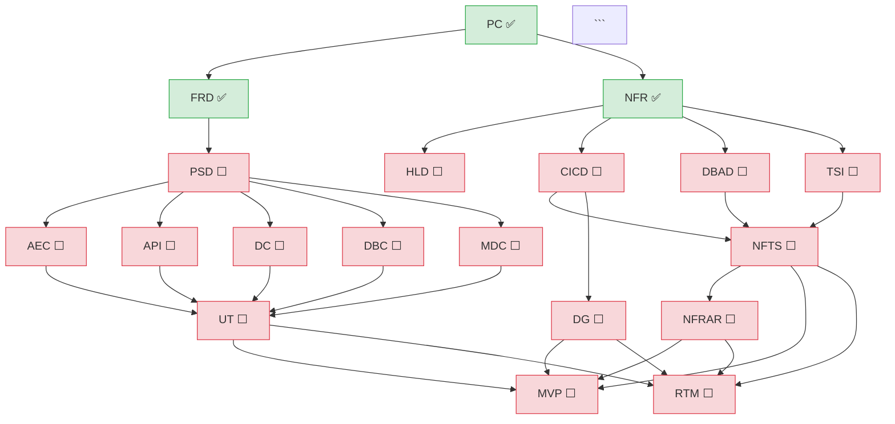

# SDLC Document Status — Quick Dashboard

## Purpose

Show the current state of all 20 SDLC document tree slots in a single
dashboard view.  No Q&A, no file creation — just scan and report.

## Environment

- **Base directory:** `.`
- **CLI module:** `knowledge/sdlc_chain/cli.py`
- **Invoke CLI as:** `python3 knowledge/sdlc_chain/cli.py <command> [args]`

## Workflow

### Step 1 — Scan existing documents

```bash
python3 knowledge/sdlc_chain/cli.py list-existing
```

Parse the JSON output. Each entry has:
- `doc_type` — one of the 20 SDLC types
- `document_id` — e.g., `PC-NPH-0001`
- `relative_path` — e.g., `knowledge/artifact/00_general/PC-NPH-0001_...json`
- `directory` — `knowledge/artifact`, `knowledge/req_doc/md`, `knowledge/req_doc/html`, or `knowledge/staging`

Group by `doc_type`. For each type, find the artifact entry (directory = `knowledge/artifact`).
Extract version from filename pattern `_v[X.Y].json`.

### Step 2 — Build the tree dashboard

Present using this format:

```
## SDLC Document Tree — Status



For each node:
- If doc exists as artifact → use `:::done` class and append ` ✅`
- If doc exists in staging → use `:::staged` class and append ` 📋`
- If doc is missing → use `:::missing` class and append ` ⬜`

### Step 3 — Show detail table

```
SDLC Tree Progress: [N] / 20 docs   [progress bar] [pct]%

| Branch     | Layer | Type  | Document ID    | Version | Status    | Path |
|------------|-------|-------|----------------|---------|-----------|------|
| Root       | 0     | PC    | PC-NPH-0001    | v0.3    | Draft     | knowledge/artifact/00_general/... |
| Functional | 1     | FRD   | FRD-NPH-0001   | v0.2    | Draft     | knowledge/artifact/10_function/... |
| Functional | 2     | PSD   | —              | —       | NOT FOUND | — |
| ...        | ...   | ...   | ...            | ...     | ...       | ... |
```

### Step 4 — Recommended next actions

Based on what exists and what's missing, recommend the next actions:

1. **Unblocked docs** — docs whose prerequisites all exist but the doc itself is missing
2. **Blocked docs** — docs whose prerequisites are partially missing
3. **Stale docs** — docs in staging that may need final approval

Format:

```
Recommended next actions:
  → Create PSD (prerequisites met: FRD exists)
  → Create HLD, CICD, TSI (prerequisites met: NFR exists)
  → DBAD needed to unblock NFTS
  → Contracts (AEC, API, DC, DBC, MDC) needed to unblock UT
```

### Step 5 — Offer next steps

```
What would you like to do?
  → /sdlc-doc-intake to create or update a document
  → /sdlc-tree to walk the full tree
  → /nfr-refresh to propagate NFR changes
```

## Rules

1. This skill is **read-only** — never create or modify files.
2. Run `list-existing` exactly once.
3. Always show the Mermaid diagram with color-coded nodes.
4. Always show the detail table.
5. Always show recommended next actions based on dependency analysis.

## Prerequisite Map (for next-action analysis)

```
FRD requires: PC
NFR requires: PC
PSD requires: FRD
AEC, API, DC, DBC, MDC require: PSD
HLD, CICD, DBAD, TSI require: NFR
NFTS requires: CICD + DBAD + TSI
DG requires: CICD
UT requires: at least one of (AEC, API, DC, DBC, MDC)
NFRAR requires: NFTS
MVP, RTM require: at least one of (NFTS, DG, UT)
DD: no prerequisites (aggregates existing artifacts)
```
