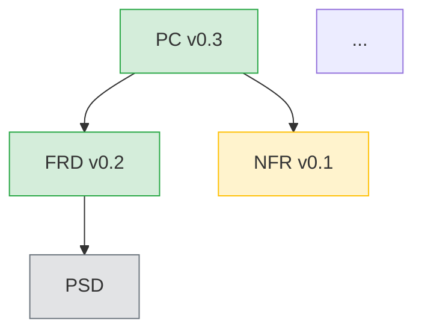

# Project Refresh — Full Health Check & Progress Dashboard

## Purpose

Single-command project health check. Scans every artifact, validates
structure, checks JSON/MD/HTML sync, detects stale downstream docs,
and produces an actionable report. Use at the start of a session or
after a batch of changes to see the full picture.

## Environment

- **Base directory:** `.`
- **CLI:** `python3 knowledge/sdlc_chain/cli.py <command> [args]`

## Workflow

### Step 1 — Scan existing documents

```bash
python3 knowledge/sdlc_chain/cli.py list-existing
```

Parse the JSON output. Group entries by `doc_type`. For each type,
find the artifact entry (directory = `knowledge/artifact`). Extract version
from filename pattern `_v[X.Y].json`.

### Step 2 — Validate each artifact

For each existing artifact JSON file:

```bash
python3 knowledge/sdlc_chain/cli.py validate [DOC_TYPE] [PATH]
```

Collect validation results: `valid`, `invalid` (with errors), or
warnings.

### Step 3 — Check file sync (JSON + MD + HTML)

For each artifact JSON, verify that matching files exist in:
- `knowledge/req_doc/md/[subdir]/` with `.md` extension
- `knowledge/req_doc/html/[subdir]/` with `.html` extension

Flag any artifact missing its rendered counterparts.

### Step 4 — Detect stale documents

For each existing doc, check if its parent docs have a newer
`last_updated` date in their metadata. A doc is **stale** if any
parent was updated after it.

Parent map:
```
FRD parents: PC
NFR parents: PC
PSD parents: FRD
AEC, API, DC, DBC, MDC parents: PSD
HLD, CICD, DBAD, TSI parents: NFR
NFTS parents: CICD, DBAD, TSI
DG parents: CICD
UT parents: AEC, API, DC, DBC, MDC (whichever exist)
NFRAR parents: NFTS
MVP, RTM parents: NFTS, DG, UT (whichever exist)
DD parents: none (aggregator)
```

Load each artifact's `metadata.last_updated` field. Compare child
vs parent timestamps. If parent is newer, flag child as stale.

### Step 5 — Present the dashboard

```
## Project Health Report

Date: [TODAY]

### Tree Status

SDLC Tree Progress: [N] / 20 docs   [progress bar] [pct]%
```

Show the Mermaid diagram with color-coded nodes:
- Existing + valid → `:::done` (green)
- Existing + stale → `:::stale` (yellow)
- Existing + invalid → `:::error` (red)
- Missing → `:::missing` (grey)



### Step 6 — Detail tables

```
### Document Inventory

| Type | ID | Version | Status | Valid | Synced | Stale | Last Updated |
|------|----|---------|--------|-------|--------|-------|-------------|
| PC | PC-NPH-0001 | v0.3 | Draft | Pass | JSON+MD+HTML | — | 2025-01-15 |
| FRD | FRD-NPH-0001 | v0.2 | Draft | Pass | JSON+MD | HTML missing | 2025-01-20 |
| NFR | NFR-0001 | v0.1 | Draft | 2 warnings | JSON+MD+HTML | Stale (PC updated after) | 2025-01-10 |
```

### Step 7 — Validation issues

If any validation errors or warnings were found:

```
### Validation Issues

| Doc | Severity | Issue |
|-----|----------|-------|
| NFR-0001 | Warning | Optional section 'compliance_mapping' missing |
| FRD-NPH-0001 | Error | Required section 'functional_requirements' empty |
```

### Step 8 — Staleness report

If any docs are stale:

```
### Stale Documents

| Doc | Last Updated | Stale Because | Action |
|-----|-------------|---------------|--------|
| NFR-0001 | 2025-01-10 | PC updated 2025-01-15 | Run /nfr-refresh or /sdlc-doc-intake NFR |
| HLD-0001 | 2025-01-12 | NFR updated 2025-01-14 | Review HLD against NFR changes |
```

### Step 9 — File sync issues

```
### File Sync Status

| Doc | JSON | MD | HTML | Action |
|-----|------|----|------|--------|
| PC-NPH-0001 | ok | ok | ok | In sync |
| FRD-NPH-0001 | ok | ok | MISSING | Regenerate HTML |
```

### Step 10 — Prioritized next actions

Based on all findings, produce a ranked action list:

```
### Recommended Actions (priority order)

1. FIX: FRD-NPH-0001 validation error — required section empty
2. SYNC: FRD-NPH-0001 — regenerate missing HTML
3. REFRESH: NFR-0001 — stale, parent PC was updated after
4. CREATE: PSD — prerequisites met (FRD exists)
5. CREATE: HLD, CICD, DBAD, TSI — prerequisites met (NFR exists)
6. BLOCKED: NFTS — needs CICD + DBAD + TSI
```

Priority order:
1. Validation errors (broken docs)
2. File sync gaps (missing MD/HTML)
3. Stale docs (parent updated after child)
4. Unblocked docs ready to create
5. Blocked docs (prerequisites missing)

### Step 11 — Offer next steps

```
What would you like to do?
  → /sdlc-doc-intake [TYPE] — create or update a document
  → /nfr-refresh — propagate NFR changes downstream
  → /doc-impact [TYPE] — see impact before changing a doc
  → /pre-generate [TYPE] — preflight check before creating
  → /project-refresh — run this report again after changes
```

## Rules

1. **Read-only** — never create or modify files.
2. Run `list-existing` exactly once.
3. Validate every existing artifact — do not skip any.
4. Always show the Mermaid diagram with 4-state color coding.
5. Always show the prioritized action list.
6. Sort actions by severity: errors → sync gaps → stale → create → blocked.
7. For staleness checks, compare `metadata.last_updated` timestamps.
   If metadata is unreadable, note it as "unknown" rather than skipping.
